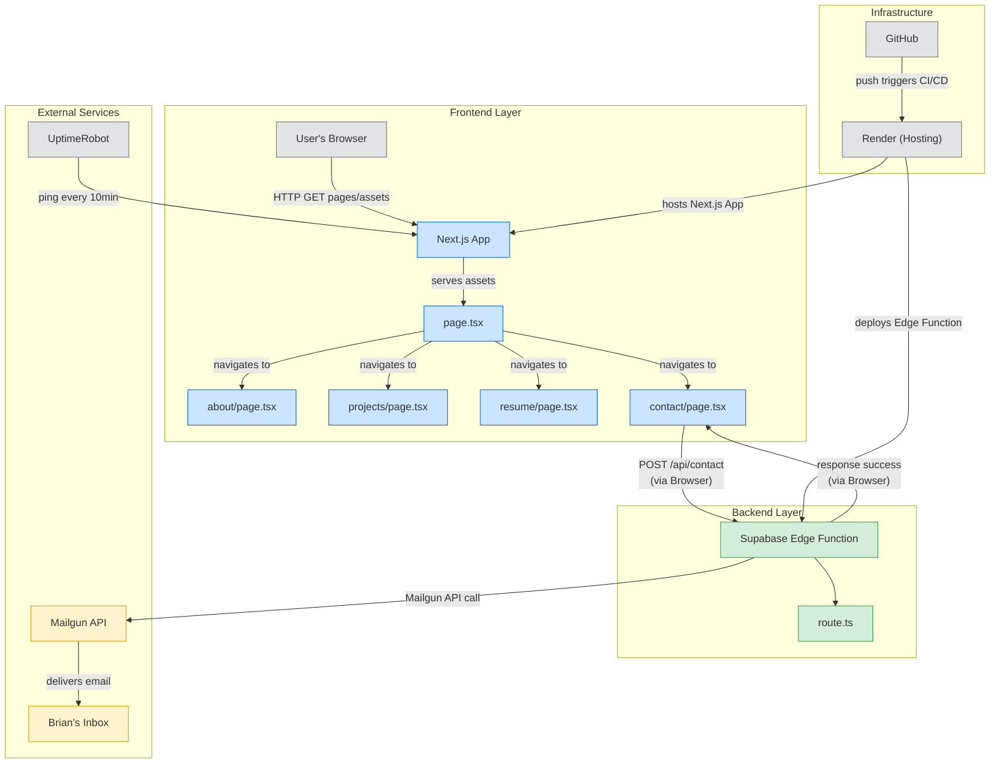

<div align="center">

## Brian's Personal Portfolio 🚀

A fully open-source and cost-free personal portfolio website built with Next.js, Tailwind CSS, and Supabase. Includes a real-time contact form powered by Supabase Edge Functions and Mailgun.

</div>

<div align="center">
  
[](https://skillicons.dev)

</div>

---

## 🌐 Live URL
*[https://brianc.onrender.com](https://brianc.onrender.com)*

---

## 📦 Setup Instructions

### Clone the repository

```bash
git clone https://github.com/bcastelino/brian-portfolio
cd brian-portfolio
```

### Install dependencies

```bash
npm install
```

### Run the project locally

```bash
npm run dev
```

---

## ✨ Features

### ✅ 1. Responsive Portfolio UI
* Clean, mobile-friendly layout using `Tailwind CSS`
* Animated sections built with `Framer Motion`
* `Light` and `dark` mode support

### 📁 2. Project & Resume Showcase
* Dedicated sections for highlighting projects
* Downloadable PDF `resume` with external link support

### 📬 3. Fully Functional Contact Form
* Accepts name, email, and message from users
* Uses `Supabase Edge Functions` to securely send messages
* Sends emails via `Mailgun` directly to your inbox

### ☁️ 4. Free & Scalable Hosting
* Hosted on `Render` using the free tier
* Auto-deploys on every `GitHub commit`

### 🔌 5. Uptime Monitoring & Wake Prevention
* Integrated with `UptimeRobot`
* Keeps the Render app “awake” 24/7 by preventing spin-down

### 📦 6. Optimized Production Builds
* `sharp` installed for image optimization in production
* `ESLint` and `Prettier` included for clean, maintainable code

### 🔐 7. Environment Secrets & Secure API Handling
* `.env` used for secure Mailgun API keys
* Supabase secrets managed via Edge Function environment settings

---

## ☁️ External Services Used
#### Render
* Hosts the frontend web app
* Connects directly to GitHub for automatic deploys
* 750 free instance hours/month

#### Supabase
* Hosts the backend function (written in Deno)
* Executes email sending logic triggered by the frontend contact form

#### Mailgun (Free Tier)
* Sends emails from the "Contact Me" form
* Configured using an API key inside a Supabase Edge Function
* Uses sandbox domain or custom domain if verified

#### UptimeRobot
* Pings the site every 10 minutes
* Prevents Render from spinning down the free instance
* Sends alerts if the site goes offline

---

## 🔄 Portfolio WorkFlow



---

## ✅ Hosting Cost Summary (Free Tier)

* **Render** (free for 1 app, 750 hrs/month)
* **Supabase** (free for Edge Functions and Postgres usage)
* **Mailgun** (free up to 100 emails/day)
* **UptimeRobot** (free for 10-minute checks)

All services used are either open source or free-tier compatible.

---

## 📬 Contact

Built and maintained by [Brian Denis Castelino](mailto:briancastelino07@gmail.com).

---

> Want to fork this? Remove the contact email or reroute it to your own Mailgun + Supabase setup.
